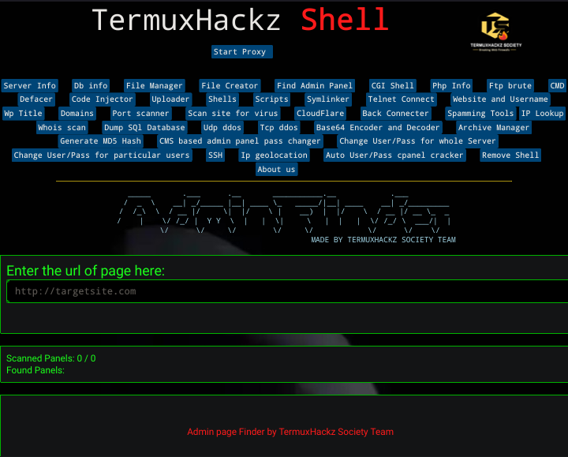
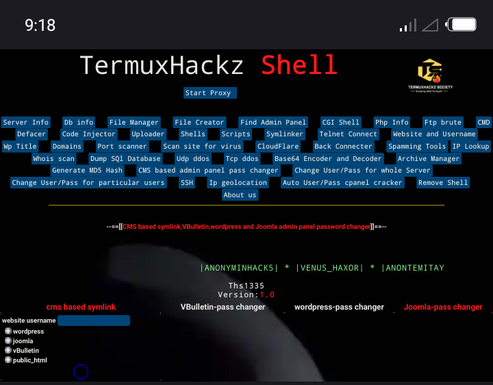

# Php-Webshell

A PHP webshell created by us TermuxHackz Society.  For educational and/or testing purposes only. 
Can also be used for ctf challenges. Our php webshell is obfuscated, which has uploader and main shell. (ths1335.php)

# Note
#### [+] Always investigate malware in a secure environment. This means: separately from your network and in a virtual machine!
#### [+] Some backdoors may be backdoored (yes, really). Don't ever use this for any malicious purposes.
#### [+] The backdoors follow the format: Backdoorname_SHA1.php, granted the name of the backdoor is known 
#### [+] The folder TermuxHackz Webshell contains the webshell (uploader and main shell[ths1335 shell]). 
#### [+] Dont just be a defacer alone!, do cool shits with the webshell. But can also be used for defacing

# Created by
<b>TermuxHackz Society Team Members - AnonyminHack5</b>
<br><br>
Ths1335.php is a powerful webshell which has several and multiple features which are useful for spammers, defacers and also 
useful for those who loves to try cool shits too haha ^_^. It contains, Fake Mailer, Whois scan, iplookup, Cracking Cpanel, Whm, Admin Panel Finder and so much more. This help bypass site security and not like other shells.

# Steps to use this webshell
```
1) Hack the site admin panel or look for site with upload option (for uploading pics, images, etc) 
2) Look for upload section 
3) First try to upload the Tuploader.php into the site
If the site restricts php files, and says only png, jpeg or jpg images allowed 
Then next step is for you to upload the payload-image.png or try some file upload bypass like tuploader.pHp, tuploader.phtml etc  


The payload-image.png is an injected code for the php file
So once the png image has been successfully uploaded
But if the payload-image doesnt work. Use some file upload bypass tricks

4) Copy the image/shell location
5) Open in a tab
6) Then once you see the uploader
7) Upload the main shell which is the ths1335.php 
8) Then you can use the shell.. 

Hahah, make sure you use with care!! 
```
# Some features of ths1335 Shell
1) File Manager
2) Dumping SQL database 
3) Find admin panel page
4) Execute ssh commands on remote server
5) TCP and UDP flood ddos
6) CGI Shell
7) Ftp brute force
8) Cracking Cpanels and Whmpanels
9) Crack WordPress sites and change all usernames and password
10) Code Injector
11) And so much fuckin more hahahaha


# Ths1335 Shell Images




 

# License
ths1335.php shell is under the MIT license. This webshell is free for all use and for home and educational usages as well. Thanks to our team of skilled programmers hahaha. 

Incase you dont like to clone from github, haha, you can download the TermuxHackz Webshell zip from mediafire. <br><br>
<strong>Download here:- <a href="" target="_blank" alt="TermuxHackz Webshell">Download TermuxHackz WebShell here</a>.</strong>       

<p>Kindly star or fork this repo, to support us for this wonderful project </p>

# Donate 
 
Donate to us if you love and appreciate the project. Donate <a href="https://paypal.me/kwasconcept" target="_blank">here</a>. Thanks for donations.... 


# Version
```
Version 1.0
```


# Notice Bugs? 
If you use our webshell and you notice bugs in em feel free to email me those bugs and We will try fix them. 
Report those bugs to me <a href="mailto:AnonyminHack5@protonmail.com" target="_blank">here</a>. 

<h5>Thanks alot for the support</h5>

# Faqs
##### 1) Some features doesn't work? 
<strong>If you notice that some features of the shell doesnt work, Try using a linux system with a good internet connection 📶 and try again. It should work. Using a windows system with this powerful webshell is limited. Thanks :) </strong>


 


